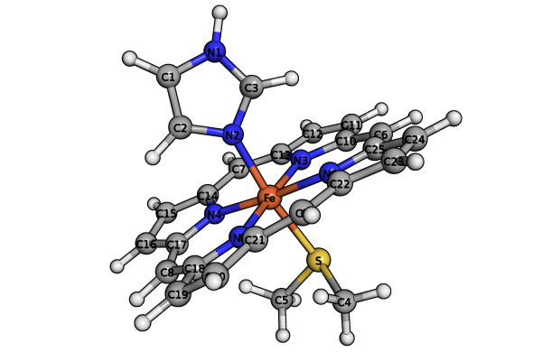

.. _`sec:methods:avas`:

Atomic Valence Active Space (AVAS)
==================================

.. codeauthor:: Chenxi Cai and Chenyang Li
.. sectionauthor:: Chenyang Li and Nan He

Overview
^^^^^^^^

This AVAS procedure provides an automatic way to generate an active space for correlation
computations by projecting MOs to an AO subspace, computing and sorting the overlaps for
a new set of rotated MOs and a suitable active space.

Given a projector :math:`\hat{P}`, AVAS builds the projected overlap matrices for
doubly occupied and virtual orbitals separately from an restricted Hartree-Fock wave function

.. math::
    S_{ij} &= \langle i | \hat{P} | j \rangle = \sum_{\mu \nu} C_{\mu i} P_{\mu\nu} C_{\nu j},
   \quad i,j \in \{\text{DOCC}\}, \\
    \bar{S}_{ab} &= \langle a | \hat{P} | b \rangle = \sum_{\mu \nu} C_{\mu a} P_{\mu\nu} C_{\nu b},
   \quad a,b \in \{\text{UOCC}\},

where the projector matrix is given by

.. math::
    P_{\mu\nu} = \sum_{pq} \langle \mu | p \rangle (\rho^{-1})_{pq} \langle q | \nu \rangle,
    \quad p, q \in \{\text{Target Valence Atomic Orbitals}\}.

The matrix :math:`\rho^{-1}` is the inverse of target AO overlap matrix
:math:`\rho_{pq} = \langle p | q \rangle`.

.. note::
    Target AOs are selected from the MINAO basis.

If the option :code:`AVAS_DIAGONALIZE` is :code:`TRUE`, AVAS will diagonalize matrices
:math:`S_{ij}` and :math:`\bar{S}_{ab}` and rotate orbitals separately such that
the Hartree-Fock energy is unaffected:

.. math::
    \mathbf{S U} &= \mathbf{U \sigma_\mathrm{DOCC}}, \quad
    \tilde{C}_{\mu i} = \sum_{j} C_{\mu j} U_{ji}, \\
    \mathbf{\bar{S} \bar{U}} &= \mathbf{\bar{U} \sigma_\mathrm{UOCC}}, \quad
    \tilde{C}_{\mu a} = \sum_{b} C_{\mu b} \bar{U}_{ba}.

The two sets of eigenvalues are combined
:math:`\mathbf{\sigma = \sigma_\mathrm{DOCC} \oplus \sigma_\mathrm{UOCC}}`
and subsequently sorted in descending order.
If :code:`AVAS_DIAGONALIZE` is set to :code:`FALSE`,
the "eigenvalues" will be directly grabbed from the diagonal elements of the projected overlap matrices
and no orbital rotation is performed.

Depending on the selection scheme, part of the orbitals with nonzero eigenvalues
are selected as active orbitals.
We then semi-canonicalize all four subsets of orbitals separately.
The final orbitals are arranged such that those considered as active lie in between
the inactive occupied and inactive virtual orbitals.

.. warning::
    The code does not support UHF reference at present.
    For ROHF reference, our implementation does not touch any singly occupied orbitals,
    which are all considered as active orbitals and assumed in canonical form.

Input example
^^^^^^^^^^^^^

In this example, we use AVAS to find an active space for formaldehyde that
spans the :math:`2p_x` orbitals of the C and O atoms, followed by a CASCI computation. ::

    import forte
    molecule H2CO{
    0 1
    C           -0.000000000000    -0.000000000006    -0.599542970149
    O           -0.000000000000     0.000000000001     0.599382404096
    H           -0.000000000000    -0.938817812172    -1.186989139808
    H            0.000000000000     0.938817812225    -1.186989139839
    noreorient  # ask Psi4 to not reorient the xyz coordinate
    }

    set {
      basis         cc-pvdz
      reference     rhf
      scf_type      pk
      e_convergence 12
    }

    set forte {
      job_type            none                 # no energy computation
      subspace            ["C(2px)","O(2px)"]  # target AOs from 2px orbitals of C and O
      avas                true                 # turn on AVAS
      avas_diagonalize    true                 # diagonalize the projected overlaps
      avas_sigma          1.0                  # fraction of eigenvalues included as active
    }
    Ezero, wfn = energy('forte', return_wfn=True)

    set forte {
      job_type            newdriver  # compute some forte energy
      active_space_solver fci        # use FCI solver
      print               1          # print level
      restricted_docc     [5,0,0,2]  # from AVAS
      active              [0,0,3,0]  # from AVAS
    }
    Ecasci = energy('forte', ref_wfn=wfn)

.. note::
    The keyword :code:`noreorient` in the :code:`molecule` section is very important
    if certain orientations of orbitals are selected in the subspace (e.g., :math:`2pz` of C).
    Otherwise, the subspace orbital selection may end up the wrong direction.

The AVAS procedure outputs::

    Sum of eigenvalues: 1.98526975

    ==> AVAS MOs Information <==

      ---------------------------------------
                         A1    A2    B1    B2
      ---------------------------------------
      DOCC INACTIVE       5     0     0     2
      DOCC ACTIVE         0     0     1     0
      SOCC ACTIVE         0     0     0     0
      UOCC ACTIVE         0     0     2     0
      UOCC INACTIVE      13     3     4     8
      ---------------------------------------
      RESTRICTED_DOCC     5     0     0     2
      ACTIVE              0     0     3     0
      RESTRICTED_UOCC    13     3     4     8
      ---------------------------------------

    ==> Atomic Valence MOs (Active Marked by *) <==

      ===============================
       Irrep    MO  Occ.  <phi|P|phi>
      -------------------------------
      *  B1      0    2      0.970513
      *  B1      1    0      0.992548
      *  B1      2    0      0.022209
      ===============================

The :code:`Sum of eigenvalues` is the sum of traces of projected overlap matrices
:math:`\mathbf{S}` and :math:`\mathbf{\bar{S}}`.
We see that AVAS generates three active orbitals of B1 symmetry.
We then use this guess of active orbitals to compute the CASCI energy: ::

    ==> Root No. 0 <==

      200     -0.98014601
      020      0.18910986

      Total Energy:      -113.911667467206598

    ==> Energy Summary <==

      Multi.(2ms)  Irrep.  No.               Energy
      ---------------------------------------------
         1  (  0)    A1     0     -113.911667467207
      ---------------------------------------------

.. note::
    Currently, the procedure is not automated enough so that
    two Forte computations need to be carried out.
    First perform an AVAS and check the output guess of active orbitals.
    Then put :code:`RESTRICTED_DOCC` and :code:`ACTIVE` in the input for
    another round of Forte computation.

For more examples, see :code:`avas-1` to :code:`avas-6` in the :code:`tests/methods` folder.
In particular, :code:`avas-6` is a practical example on ferrocene.

Defining the molecular plane for π orbitals
^^^^^^^^^^^^^^^^^^^^^^^^^^^^^^^^^^^^^^^^^^^

Molecular systems with conjugated π bonds are often arranged into planar geometries.
For such systems, it often desirable to select an active space that includes π orbitals perpendicular to the plane.
Each π orbital is a linear combination of atomic p orbitals, which are also perpendicular to the plane.
However, unlike the case of formaldehyde, where it easy to select the appropriate π and π* orbitals,
in the more general case a π orbital is a linear combination of :math:`2p_x`, :math:`2p_y`, and :math:`2p_z` orbitals.
The approach described in the previous section is not flexible enough to treat general π systems
like molecules containing multiple π systems or π systems that are not aligned with a specific molecular axis.

There are two ways to fix this problem.
One is to reorient the molecule such that the molecular plane lying in yz plane.
However, this approach is not flexible enough to treat multiple π systems in a molecule.
The other approach is to use all :math:`p_x`, :math:`p_y`, :math:`p_z` orbitals as basis,
using which the p orbital perpendicular to the plane can be defined.
To do this, we need to specify two keywords: :code:`SUBSPACE` and :code:`SUBSPACE_PI_PLANES`.
The option :code:`SUBSPACE_PI_PLANES` takes a list of atoms (3 or more) that form a plane,
and in this case is used to define the π plane.
Note that this option uses the same syntax as :code:`SUBSPACE`,
whereby indicating an element (e.g., H) includes all the hydrogen atoms in the list that defines the plane.
The option :code:`SUBSPACE`, is used to select all the 2p orbitals,
because neither of the three directions is perpendicular to the π plane.
This leads to the following input section of AVAS: ::

  set forte {
    subspace           ["C(2p)","O(2p)"]  # must include all 2p orbitals!
    subspace_pi_planes [["C","O","H"]]    # only one plane, defined by all C, O and H atoms
    avas               true
    avas_diagonalize   true
    avas_sigma         1.0
  }

and the output is now identical to the very first example ::

  ==> Atomic Valence MOs (Active Marked by *) <==

    ===============================
     Irrep    MO  Occ.  <phi|P|phi>
    -------------------------------
    *   A      0    2      0.970513
    *   A      8    0      0.992548
    *   A      9    0      0.022209
    ===============================

Some comments on the expressions of :code:`SUBSPACE_PI_PLANES` are necessary.
Possible expressions to define the π planes include: ::

  - [['C', 'H', 'O']]              # only one plane consisting all C, H, and O atoms of the molecule.
  - [['C1-6'], ['N1-2', 'C9-11']]  # plane 1 with the first six C atoms of the molecule,
                                   # plane 2 with C atoms #9, #10, and #11, and N atoms #1 and #2.
  - [['C1-4'], ['C1-2', 'C5-6']]   # plane 1 with the first four C atoms of the molecule,
                                   # plane 2 with C atoms #1, #2, #5, and #6.
                                   # Two planes share C1 and C2!

This syntax follows the one used by :code:`SUBSPACE`: ::

  - ["C"]              # all carbon atoms
  - ["C","N"]          # all carbon and nitrogen atoms
  - ["C1"]             # carbon atom #1
  - ["C1-3"]           # carbon atoms #1, #2, #3
  - ["C(2p)"]          # the 2p subset of all carbon atoms
  - ["C(1s)","C(2s)"]  # the 1s/2s subsets of all carbon atoms
  - ["C1-3(2s)"]       # the 2s subsets of carbon atoms #1, #2, #3
  - ["Ce(4fzx2-zy2)"]  # the 4f zxx-zyy orbital of all Ce atoms

Essentially, :code:`SUBSPACE_PI_PLANES` defines a list of planes and the code attaches each atom of the plane
with the plane unit normal :math:`\mathbf{n} = (n_x, n_y, n_z)`.
A complete subset of atomic p orbitals (:math:`p_x`, :math:`p_y`, :math:`p_z`) are projected onto that vector
so that the target p orbital becomes :math:`|p\rangle = \sum_{i \in \{x,y,z\}} n_i |p_i \rangle`.
This means we attach a coefficient to every subspace orbital,
where the coefficient of the :math:`p_i` orbital on the atom of the plane is :math:`n_i`,
while the coefficient for all other subspace AOs is 1.0.
The projector is then modified as

.. math::
    P_{\mu\nu} = \sum_{r's'} \langle \mu | r' \rangle (\rho^{-1})_{r's'} \langle s' | \nu \rangle,
    \quad r', s' \in \{\text{Target Valence Atomic Orbitals}\},

where :math:`|r'\rangle = \sum_{r} C_{rr'} |r\rangle` and :math:`|r\rangle` are the AOs from the MINAO basis set.
The coefficient matrix :math:`C_{rr'}` is given by

.. math::
    C_{rr'} =
    \begin{cases}
      n_i, \quad& r' \in \{p \text{ orbitals on plane atoms if planes are defined}\}, \\
      1.0, \quad& r' \in \{\text{other AOs in the subspace chosen by the user}\}, \\
      0, \quad& \text{otherwise}.
    \end{cases}

.. note::
    It is very important to include a complete set of p orbitals in :code:`SUBSPACE` if π planes are defined.
    Otherwise, the code will follow the directions given by :code:`SUBSPACE`.

.. tip::
    The code is flexible enough to treat double active spaces (e.g., double π or double d-shell).
    For example, the double-π active space of formaldehyde can be obtained via ::

      set forte {
        minao_basis        double-shell
        subspace           ["C(2p)","C(3p)","O(2p)","O(3p)"]
        subspace_pi_planes [["C","O","H"]]
        avas               true
        avas_diagonalize   true
        avas_cutoff        0.5
      }

    Here I prepare a basis called "double-shell.gbs", which includes the 2p and 3p orbitals of C and O atoms.
    You can also prepare your own MINAO basis by truncating the the cc-pVTZ or ANO-RCC-VTZP basis sets.

Systems with multiple π systems
^^^^^^^^^^^^^^^^^^^^^^^^^^^^^^^

For a more realistic example, consider the following iron porphyrin related molecule:

By checking the geometry, we see that the molecule contains two π systems, namely, porphyrin and imidazole.
The π orbitals are perpendicular to the corresponding planes.
However, the porphyrin is not a perfect plane and we assume the π orbitals are
perpendicular to the averaged plane formed by the porphyrin backbone.
The iron 3d orbitals may interact with the π orbitals of porphyrin and imidazole rings
and the sulfur 3p orbitals.
We would like to ask AVAS to select these orbitals as active, which can be achieved by the following ::

  set forte {
    avas                true
    avas_diagonalize    true
    avas_cutoff         0.5
    minao_basis         cc-pvtz-minao
    subspace            ["Fe(3d)","C6-25(2p)","N(2p)","S(3p)","C1-3(2p)"]
    subspace_pi_planes  [["Fe","C6-25","N3-6"], ["N1-2","C1-3"]]
  }

Here, the porphyrin plane is defined by the iron atom, carbon atoms #6 to #25, and nitrogen atoms #3 to #6.
The imidazole plane is defined by the first two nitrogen atoms and the first three carbon atoms.
The atom ordering is consistent with the one used in the molecule section of the input (see the figure).
The AVAS output selects exactly 37 orbitals we wanted. ::

  ==> AVAS MOs Information <==

    ---------------------
                        A
    ---------------------
    DOCC INACTIVE     106
    DOCC ACTIVE        22
    SOCC ACTIVE         0
    UOCC ACTIVE        15
    UOCC INACTIVE     462
    ---------------------
    RESTRICTED_DOCC   106
    ACTIVE             37
    RESTRICTED_UOCC   462
    ---------------------

  ==> Atomic Valence MOs (Active Marked by *) <==

    ===============================
     Irrep    MO  Occ.  <phi|P|phi>
    -------------------------------
    *   A      0    2      0.999085
    *   A      1    2      0.998642
    ...
    *   A     19    2      0.974919
    *   A     20    2      0.855068
    *   A     21    2      0.747171
        A     22    2      0.215276
        A     23    2      0.175599
    ...
        A     36    2      0.000408
    *   A    128    0      0.999163
    *   A    129    0      0.997849
    ...
    *   A    140    0      0.943277
    *   A    141    0      0.824388
    *   A    142    0      0.784721
        A    143    0      0.252635
        A    144    0      0.144740
    ...
        A    164    0      0.000898
    ===============================

The code is also flexible enough treat planes that share some atoms.
Let's assume atom A is shared by planes :math:`P_1` and :math:`P_2`
with the plane unit normals :math:`\mathbf{n}_1` and :math:`\mathbf{n}_2`, respectively.
The positive direction of :math:`\mathbf{n}_i` (:math:`i = 1, 2`) is taken such that
:math:`\mathbf{n}_i \cdot \mathbf{d} \geq 0`, where :math:`\mathbf{d}` is the vector from
the centroid of the molecule to the centroid of the plane :math:`P_i`.
The vector attached to atom A is then a normalized vector sum given by
:math:`\mathbf{n}_\mathrm{A} = (\mathbf{n}_1 + \mathbf{n}_2) / || \mathbf{n}_1 + \mathbf{n}_2 ||`.
Based on this feature, we may ask AVAS to pick the π active space for C20 fullerene (see test case avas-8).
For C20 fullerene, there are 12 planes forming the cage
and we would like to make the target valence AOs pointing outwards the cage sphere.
The planes can be specified manually or figured out using the nearest and second nearest neighbors of an atom.

Options
^^^^^^^

**AVAS**

Turn on the AVAS procedure or not.

* Type: Boolean
* Default: False

**AVAS_DIAGONALIZE**

Diagonalize the projected overlap matrices or not.

* Type: Boolean
* Default: True

**AVAS_EVALS_THRESHOLD**

Threshold smaller than which is considered as zero for
an eigenvalue of the projected overlap matrices.

* Type: double
* Default: 1.0e-6

**AVAS_SIGMA**

Cumulative threshold to the eigenvalues of the projected overlap matrices
to control the output number of active orbitals.
Orbitals will be added to the active subset starting from that of the largest
:math:`\sigma` value and stopped when
:math:`\sum_{u}^{\rm ACTIVE} \sigma_{u} / \sum_{p}^{\rm ALL} \sigma_{p}`
is larger than the threshold.

* Type: double
* Default: 0.98

**AVAS_CUTOFF**

The threshold greater than which to the eigenvalues of the projected overlap
matrices will be considered as active orbitals. If not equal to 1.0, it takes
priority over the sigma threshold selection.

* Type: double
* Default: 1.0

**AVAS_NUM_ACTIVE**

The total number of orbitals considered as active for
doubly occupied and virtual orbitals (singly occupied orbitals not included).
If not equal to 0, it will take priority over the sigma or cutoff selections.

* Type: int
* Default: 0

**AVAS_NUM_ACTIVE_OCC**

The number of doubly occupied orbitals considered as active.
If not equal to 0, it will take priority over the selection schemes based on
sigma and cutoff selections and the total number of active orbitals.

* Type: int
* Default: 0

**AVAS_NUM_ACTIVE_VIR**

The number of virtual orbitals considered as active.
If not equal to 0, it will take priority over the selection schemes based on
sigma and cutoff selections and the total number of active orbitals.

* Type: int
* Default: 0

Citation Reference
^^^^^^^^^^^^^^^^^^

Automated Construction of Molecular Active Spaces from Atomic Valence Orbitals |br|
`J. Chem. Theory Comput. 13, 4063-4078 (2017) <https://pubs.acs.org/doi/10.1021/acs.jctc.7b00128>`_.

.. |br| raw:: html

    
