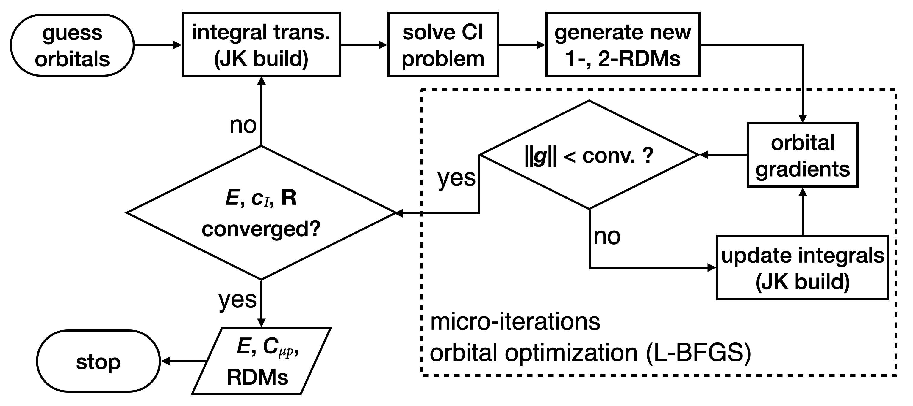

.. _`sec:methods:mcscf`:

MCSCF: Multi-Configuration Self-Consistent Field
================================================

.. codeauthor:: Chenyang Li, Kevin P. Hannon, Meng Huang, Shuhe Wang

.. sectionauthor:: Chenyang Li

Theory
^^^^^^

The Multi-Configuration Self-Consistent Field (MCSCF) tries to optimize the orbitals
and the CI coefficients for a multi-configuration wave function:

.. math:: |\Psi \rangle = \sum_{I}^{N_{\rm det}} c_{I} | \Phi_I \rangle,

where :math:`c_I` is the coefficient for Slater determinant :math:`\Phi_I`.
In MCSCF, the molecular orbitals (MOs) are generally separated into three subsets:
core (:math:`\mathbf{C}`, doubly occupied),
active (:math:`\mathbf{A}`),
and virtual (:math:`\mathbf{V}`, unoccuied).
The set of determinants are formed by arranging the number of active electrons
(i.e., the total number of electrons minus twice the number of core orbitals)
in the active orbitals.
There are many ways to pick the determinant basis, including complete active space (CAS),
restricted active space (RAS), generalized active space (GAS),
and other selective configuration interaction schemes (such as ACI).

For convenience, we first introduce the following convention for orbital indices:
:math:`i, j` for core orbitals,
:math:`t, u, v, w` for active orbitals,
and :math:`a, b` for virtual orbitals.
General orbitals (core, active, or virtual) are denoted using indices :math:`p,q,r,s`.

The MCSCF energy can be expressed as

.. math:: E = \sum_{tu}^{\bf A} f^{\rm c}_{tu} \, D_{tu} + \frac{1}{2} \sum_{tuvw}^{\bf A} (tu|vw)\, \overline{D}_{tu,vw} + E_{\rm c} + E_{\rm nuc},

where :math:`f^{\rm c}_{pq} = h_{pq} + \sum_{i}^{\bf C} [2 (pq|ii) - (pi|iq)]` are the closed-shell Fock matrix elements
and :math:`(pq|rs)` are the MO two-electron integrals in chemists' notation.
The term :math:`E_{\rm c} = \sum_{j}^{\bf C} (h_{jj} + f^{\rm c}_{jj})` is the closed-shell energy and :math:`E_{\rm nuc}` is the nuclear repulsion energy.
We have also used the 1- and 2-body reduced density matrices (RDMs) defined respectively as
:math:`D_{tu} = \sum_{IJ} c_I c_J \langle \Phi_I | \hat{E}_{tu} | \Phi_J \rangle`
and :math:`D_{tu,vw} = \sum_{IJ} c_I c_J \langle \Phi_I | \hat{E}_{tu,vw} | \Phi_J \rangle`,
where the unitary group generators are defined as
:math:`\hat{E}_{tu} = \sum_{\sigma}^{\uparrow \downarrow} a^\dagger_{t_\sigma} a_{u_\sigma}` and
:math:`\hat{E}_{tu,vw} = \sum_{\sigma\tau}^{\uparrow \downarrow} a^\dagger_{t_\sigma} a_{u_\sigma} a^\dagger_{v_\tau} a_{w_\tau}`.
Moreover, we use the symmetrized 2-RDM in the MCSCF energy expression such that it has the same 8-fold symmetry as the two-electron integrals:
:math:`\overline{D}_{tu,vw} = \frac{1}{2} (D_{tu,vw} + D_{ut,vw})`.

There are then two sets of parameters in MCSCF:
1) CI coefficients :math:`\{c_I|I = 1,2,\dots,N_{\rm det}\}`, and
2) MO coefficients :math:`\{C_{\mu p}| p = 1,2,\dots,N_{\rm MO}\}` with :math:`| \phi_p \rangle = \sum_{\mu}^{\rm AO} C_{\mu p} | \chi_{\mu} \rangle`.
The goal of MCSCF is then to optimize both sets of parameters to minimize the energy,
subject to orthonormal molecular orbitals
:math:`| \phi_p^{\rm new} \rangle = \sum_{s} | \phi_s^{\rm old} \rangle U_{sp}`,
:math:`{\bf U} = \exp({\bf R})` with :math:`{\bf R}^\dagger = -{\bf R}`.
It is then straightforward to see the two steps in MCSCF:
CI optimization (for given orbitals) and orbital optimization (for given RDMs).

Implementation
^^^^^^^^^^^^^^

In Forte, we implement the atomic-orbital-driven two-step MCSCF algorithm based on JK build.
We largely follow the article by Hohenstein et al.
[`J. Chem. Phys. 142, 224103 (2015) <https://doi.org/10.1063/1.4921956>`_]
with exceptions on the orbital diagonal Hessian which can be found in
`Theor. Chem. Acc. 97, 88-95 (1997) <http://link.springer.com/10.1007/s002140050241>`_
(non-redundant rotaions) and
`J. Chem. Phys. 152, 074102 (2020) <https://doi.org/10.1063/1.5142241>`_
(active-active rotaions).
The difference is that we improve the orbital optimization step via L-BFGS iterations
to obtain a better approxiamtion to the orbital Hessian.
The optimization procedure is shown in the following figure:

All types of integrals available in Forte are supported for energy computations.

.. note::
  External integrals read from a FCIDUMP file (:code:`CUSTOM`) are supported,
  but their use in the current code is very inefficient,
  which requires further optimization.

Besides MCSCF energies, we have also implement analytic MCSCF energy gradients.
Frozen orbitals are allowed for computing both the energy and gradients,
although these frozen orbitals must come from canonical Hartree-Fock
in order to compute analytic gradients.

.. warning::
  The density-fitted (:code:`DF`, :code:`DISKDF`)
  and Cholesky-decomposed (:code:`CHOLESKY`) integrals are fully supported for energy computations.
  However, there is a small discrepancy for gradients between analytic results and finite difference.
  This is caused by the DF derivative integrals in Psi4.

  Meanwhile, analytic gradient calculations are not available for FCIDUMP (:code:`CUSTOM`) integrals.

Input Example
^^^^^^^^^^^^^

The following input (see :code:`tests/manual/mcscf-1/input.dat`) performs an MCSCF calculation on CO molecule and 
Specifically, this is a CASSCF(6,6)/cc-pCVDZ calculation.
::

    # tests/manual/mcscf-1/input.dat

    import forte

    molecule CO{
    0 1
    C
    O  1 1.128
    }

    set {
      basis                cc-pcvdz
      reference            rhf
      e_convergence        10
      d_convergence        8
      docc                 [5,0,1,1]
    }

    set forte {
      active_space_solver  fci
      restricted_docc      [4,0,0,0]
      active               [2,0,2,2]
      e_convergence        8  # energy convergence of the FCI iterations
      r_convergence        8  # residual convergence of the FCI iterations
      mcscf_e_convergence  8  # energy convergence of the MCSCF iterations
      mcscf_g_convergence  6  # gradient convergence of the MCSCF iterations
      mcscf_micro_maxiter  4  # do at most 4 micro iterations per macro iteration
    }

    energy('forte')

Near the end of the output, we can find a summary of the MCSCF iterations:
::

    ==> MCSCF Iterations <==

                        Energy CI                    Energy Orbital
            ------------------------------  ------------------------------
      Iter.        Total Energy       Delta        Total Energy       Delta  Orb. Grad.  Micro
      ----------------------------------------------------------------------------------------
        1    -112.799334478816 -1.1280e+02   -112.835361046366 -1.1284e+02  9.0014e-03    4/N
        2    -112.843929490680 -1.1284e+02   -112.850192701163 -1.1285e+02  9.8284e-03    4/N
        3    -112.862380136782 -6.3046e-02   -112.870774577019 -3.5414e-02  3.4663e-03    4/N
        4    -112.871727851451 -2.7798e-02   -112.871822724588 -2.1630e-02  1.4560e-03    4/N
        5    -112.871841756076 -9.4616e-03   -112.871846159544 -1.0716e-03  1.1426e-04    4/N
        6    -112.871847288432 -1.1944e-04   -112.871847575122 -2.4851e-05  2.4092e-05    4/N
        7    -112.871847655079 -5.8990e-06   -112.871847676651 -1.5171e-06  5.0938e-06    4/N
        8    -112.871847682874 -3.9444e-07   -112.871847684607 -1.0948e-07  1.2387e-06    4/N
        9    -112.871847685113 -3.0034e-08   -112.871847685255 -8.6038e-09  3.2736e-07    3/Y
       10    -112.871847685297 -2.4229e-09   -112.871847685309 -7.0253e-10  7.3159e-08    2/Y
      ----------------------------------------------------------------------------------------

The last column shows the number of micro iterations used in a given macro iteration.

To obtain the analytic energy gradients, just replace the last line of the above input to ::

    gradient('forte')

See the file :code:`tests/manual/mcscf-2/input.dat` for more details.

The output prints out all the components that contribute to the energy first derivatives: ::

  -Total gradient:
     Atom            X                  Y                   Z
    ------   -----------------  -----------------  -----------------
       1        0.000000000000     0.000000000000     0.026131035245
       2        0.000000000000     0.000000000000    -0.026131035245

The :code:`Total gradient` can be compared with that from finite-difference calculations: ::

    1     0.00000000000000     0.00000000000000     0.02613110169796
    2     0.00000000000000     0.00000000000000    -0.02613110169796

obtained by adding to the input (see :code:`tests/manual/mcscf-3/input.dat`) ::

    set findif{
      points 5
    }

    G, wfn = gradient('forte', dertype=0, return_wfn=True)
    wfn.gradient().print_out()

Here the difference between finite difference and analytic formalism is 6.6E-8,
which is reasonable as our energy only converges to 1.0E-8.
Note that only the `total` gradient is available for finite-difference calculations.

The geometry optimization is invoked by (see :code:`tests/manual/mcscf-4/input.dat`) ::

    optimize('forte')                                     # Psi4 optimization procedure

    mol = psi4.core.get_active_molecule()                 # grab the optimized geoemtry
    print(mol.to_string(dtype='psi4', units='angstrom'))  # print geometry to screen

Assuming the initial geometry is close to the equilibrium, we can also pass the MCSCF
converged orbitals of the initial geometry as an initial orbital guess for subsequent
geometries along the optimization steps ::

    Ecas, ref_wfn = energy('forte', return_wfn=True)      # energy at initial geometry
    Eopt = optimize('forte', ref_wfn=ref_wfn)             # Psi4 optimization procedure

    mol = psi4.core.get_active_molecule()                 # grab optimized geometry
    print(mol.to_string(dtype='psi4', units='angstrom'))  # print geometry to screen

Similarly, we can also optimize geometries using finite difference technique: ::

    Ecas, ref_wfn = energy('forte', return_wfn=True)      # energy at initial geometry
    Eopt = optimize('forte', ref_wfn=ref_wfn, dertype=0)  # Psi4 optimization procedure

.. warning::
    After optimization, the input :code:`ref_wfn` no longer holds the data of the
    initial geometry!

.. tip::
    We could use this code to perform FCI analytic energy gradients
    (and thus geometry optimizations).
    The trick is to set all correalted orbitals as active.
    In test case :code:`casscf-opt-3`, we optimize the geometry of HF molecule at the
    FCI/3-21G level of theory with frozen 1s orbital of F.
    Note that frozen orbitals will be kept as they are in the original geometry and
    therefore the final optimized geometry will be slightly different
    if a different starting geometry is used.

Handling of Frozen Orbitals
^^^^^^^^^^^^^^^^^^^^^^^^^^^

Frozen orbitals are allowed in MCSCF calculations, but by default **Forte will not freeze any orbitals
in the MCSCF procedure**.
This is done because the most likely use case is to freeze the core orbitals only in post-MCSCF computations.
The MCSCF code will combine the value of the :code:`FROZEN_DOCC` option with the :code:`RESTRICTED_DOCC` option to
determine the restricted doubly occupied orbitals in the MCSCF procedure.

For example, the following input first runs an MCSCF computation without frozen core and then a DSRG-MRPT2
computation with two doubly occupied orbitals frozen ::

    set forte {
      active_space_solver  fci
      correlation_solver   dsrg-mrpt2
      frozen_docc          [2,0,0,0]  # freeze the 1s orbital of C and O in post-MCSCF only
      restricted_docc      [2,0,0,0]
      active               [2,0,2,2]      
    }

.. warning::
  It is generally recommend to run MCSCF without freezing the core orbitals. However, the choice
  of freezing the core orbitals in post-MCSCF computations of the dynamical correlation energy
  should depend on the type of basis set used and the nature of the system. For example,
  basis sets like the cc-pVXZ family, are designed to be used with the frozen core approximation.
  

To override this behavior and freeze the core orbitals in the MCSCF procedure, the user can set the option
:code:`MCSCF_FREEZE_CORE` to :code:`True`.
This might be necessary in certain cases, if orbital rotations involving core orbitals cause convergence issues.
The following input (see :code:`tests/manual/mcscf-5/input.dat`) performs an MCSCF calculation on CO molecule and
freezes the 1s orbital of the carbon and oxygen atoms
::

    # tests/manual/mcscf-5/input.dat

    ...

    set forte {
      active_space_solver  fci
      frozen_docc          [2,0,0,0]  # freeze the 1s orbital of C and O
      restricted_docc      [2,0,0,0]
      active               [2,0,2,2]      
      e_convergence        8
      r_convergence        8
      mcscf_e_convergence  8
      mcscf_g_convergence  6
      mcscf_micro_maxiter  4
      mcscf_freeze_core    true  # enables freezing the MCSCF core orbitals
    }

    energy('forte')
  

Examining the output, we can see that the final energy is a bit higher than the previous calculation
::

    ==> MCSCF Iterations <==
      
                        Energy CI                    Energy Orbital
            ------------------------------  ------------------------------
      Iter.        Total Energy       Delta        Total Energy       Delta  Orb. Grad.  Micro
      ----------------------------------------------------------------------------------------
        1    -112.799334478816 -1.1280e+02   -112.835286911286 -1.1284e+02  1.0500e-02    4/N
        2    -112.843867016801 -1.1284e+02   -112.850214130959 -1.1285e+02  1.1545e-02    4/N
        3    -112.862613441721 -6.3279e-02   -112.870826351022 -3.5539e-02  4.1191e-03    4/N
        4    -112.871721430617 -2.7854e-02   -112.871811073242 -2.1597e-02  1.6499e-03    4/N
        5    -112.871829192193 -9.2158e-03   -112.871833400256 -1.0070e-03  1.2771e-04    4/N
        6    -112.871834482151 -1.1305e-04   -112.871834757156 -2.3684e-05  2.6644e-05    4/N
        7    -112.871834833934 -5.6417e-06   -112.871834854642 -1.4544e-06  5.5983e-06    4/N
        8    -112.871834860617 -3.7847e-07   -112.871834862280 -1.0512e-07  1.3551e-06    4/N
        9    -112.871834862765 -2.8831e-08   -112.871834862902 -8.2598e-09  3.5729e-07    3/Y
       10    -112.871834862943 -2.3252e-09   -112.871834862954 -6.7404e-10  7.6786e-08    2/Y
      ----------------------------------------------------------------------------------------

Options
^^^^^^^

Basic Options
~~~~~~~~~~~~~

**MCSCF_MAXITER**

The maximum number of macro iterations.

* Type: int
* Default: 100

**MCSCF_MICRO_MAXITER**

The maximum number of micro iterations.

* Type: int
* Default: 40

**MCSCF_MICRO_MINITER**

The minimum number of micro iterations.

* Type: int
* Default: 6

**MCSCF_E_CONVERGENCE**

The convergence criterion for the energy (two consecutive energies).

* Type: double
* Default: 1.0e-8

**MCSCF_G_CONVERGENCE**

The convergence criterion for the orbital gradient (RMS of gradient vector).
This value should be roughly in the same order of magnitude as MCSCF_E_CONVERGENCE.
For example, given the default energy convergence (1.0e-8),
set MCSCF_G_CONVERGENCE to 1.0e-7 -- 1.0e-8 for a better convergence behavior.

* Type: double
* Default: 1.0e-7

**MCSCF_MAX_ROTATION**

The max value allowed in orbital update vector.
If a value in the orbital update vector is greater than this number,
the update vector will be scaled by this number / max value.

* Type: double
* Default: 0.2

**MCSCF_DIIS_START**

The iteration number to start DIIS on orbital rotation matrix R.
DIIS will not be used if this number is smaller than 1.

* Type: int
* Default: 15

**MCSCF_DIIS_MIN_VEC**

The minimum number of DIIS vectors allowed for DIIS extrapolation.

* Type: int
* Default: 3

**MCSCF_DIIS_MAX_VEC**

The maximum number of DIIS vectors, exceeding which the oldest vector will be discarded.

* Type: int
* Default: 8

**MCSCF_DIIS_FREQ**

How often to do a DIIS extrapolation.
For example, 1 means do DIIS every iteration and 2 is for every other iteration, etc.

* Type: int
* Default: 1

**MCSCF_CI_SOLVER**

Which active space solver to be used.

* Type: string
* Options: CAS, FCI, ACI, PCI
* Default: CAS

**MCSCF_DEBUG_PRINTING**

Whether to enable debug printing.

* Type: Boolean
* Default: False

**MCSCF_FINAL_ORBITAL**

What type of orbitals to be used for redundant orbital pairs for a converged calculation.

* Type: string
* Options: CANONICAL, NATURAL, UNSPECIFIED
* Default: CANONICAL

**MCSCF_NO_ORBOPT**

Turn off orbital optimization procedure if true.

* Type: Boolean
* Default: False

**MCSCF_DIE_IF_NOT_CONVERGED**

Stop Forte if MCSCF did not converge.

* Type: Boolean
* Default: True

Expert Options
~~~~~~~~~~~~~~~

**MCSCF_INTERNAL_ROT**

Whether to enable pure internal (GASn-GASn) orbital rotations.

* Type: Boolean
* Default: False

**MCSCF_ZERO_ROT**

Zero the optimization between orbital pairs.
Format: [[irrep1, mo1, mo2], [irrep1, mo3, mo4], ...] where
irreps are 0-based, while MO indices are 1-based and relative within the irrep.
For example, zeroing the mixing of 3A1 and 2A1 translates to [[0, 3, 2]].

* Type: array
* Default: No Default

**MCSCF_ACTIVE_FROZEN_ORBITAL**

A list of active orbitals to be frozen in the casscf optimization.
Active orbitals contain all GAS1, GAS2, ..., GAS6 orbitals.
Orbital indices are zero-based and in Pitzer ordering.
For example, GAS1 [1,0,0,1]; GAS2 [1,2,2,1];
MCSCF_ACTIVE_FROZEN_ORBITAL [2,6]
means we freeze the first A2 orbital in GAS2 and the B2 orbital in GAS1.
This option is useful when doing core-excited state computations.

* Type: array
* Default: No Default

CPSCF Options
~~~~~~~~~~~~~

**CPSCF_MAXITER**

Max number of iterations for solving coupled perturbed SCF equation

* Type: int
* Default: 50

**CPSCF_CONVERGENCE**

Convergence criterion for the CP-SCF equation

* Type: double
* Default: 1.0e-8

